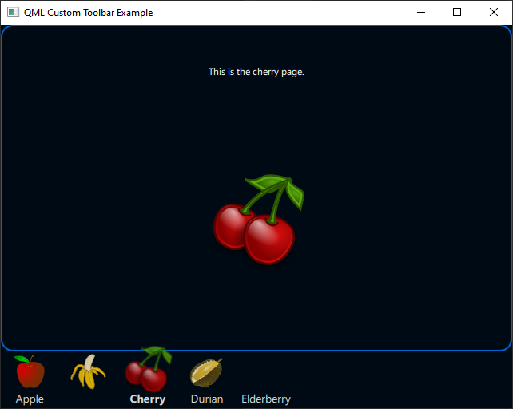

# qml-custom-toolbar

A QML custom toolbar example.

Creates a toolbar of items from a model. Uses delegates to display all model items.



## Example

```qml
//
// The custom toolbar for changing page content.
//
PageToolbar {
    id: pageToolbar
    stackView: stackView

    model: ListModel {
        ListElement {
            pageTitle: "Apple"
            pageIcon: "images/apple.svg"
            pageSource: "pages/apple.qml"
        }
        ListElement {
            pageIcon: "images/banana.svg"
            pageSource: "pages/banana.qml"
        }
        ListElement {
            pageTitle: "Cherry"
            pageIcon: "images/cherry.svg"
            pageSource: "pages/cherry.qml"
        }
        ListElement {
            pageTitle: "Durian"
            pageIcon: "images/durian.svg"
            pageSource: "pages/durian.qml"
        }
        ListElement {
            pageTitle: "Elderberry"
            pageSource: "pages/elderberry.qml"
        }
    }
}
```
